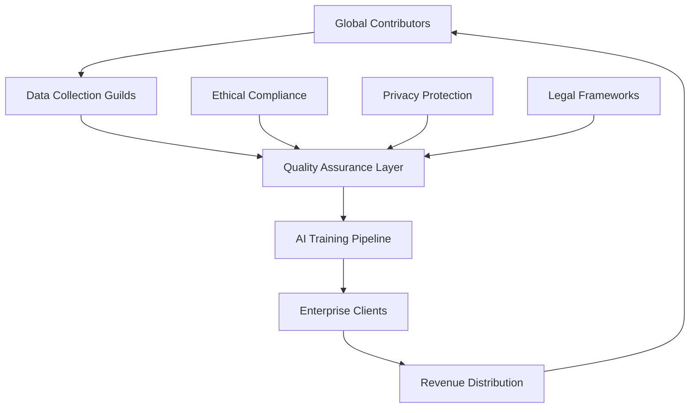

# DataSphere Guilds: The AI Data Revolution
## Comprehensive Data Collection & Monetization Platform for the AI Era

---

<div align="center">

**🌟 Transforming Global Contributors into AI Data Entrepreneurs 🌟**

*The definitive platform where individuals become the architects of AI's future through high-value data contribution*

[](https://datasphere-guilds.com)
[](https://datasphere-guilds.com)
[](https://datasphere-guilds.com)

</div>

---

## 🎯 Executive Summary

In the era of AI supremacy, **data is the new petroleum** – and an unprecedented demand chasm has emerged for premium, diverse datasets. AI systems across every industry face a "silent data crisis," struggling with insufficient real-world training data to fuel exponential progress. The DataSphere Guilds platform revolutionizes this landscape by empowering **10+ million individuals globally** to become sovereign data entrepreneurs, collecting and annotating the critical datasets that AI desperately needs.

### 📊 Market Opportunity
- **$15.7 billion** AI training data market by 2030 (27.4% CAGR)
- **30 million** skilled data labeler shortage globally
- **$1.3B+** text data segment (largest share)
- **$1.1B+** vision/imaging data segment
- **$1.0B+** audio/speech data segment

### 🎯 Value Proposition
Transform the data collection paradigm from corporate-controlled to **distributed entrepreneurship**, where every smartphone becomes a data collection station and every individual becomes their own boss in the AI economy.

---

## 🏗️ Platform Architecture Overview

### Core Value Engine


### Revenue Model
- **70%** to contributors (industry-leading revenue share)
- **20%** platform operations and technology
- **10%** growth and expansion fund

---

## 📈 Data Categories & Market Analysis

### 1. 🎥 Vision & Imaging: AI's Visual Intelligence Engine
**Market Size: $1.1 billion | Growth Rate: 24.3% CAGR**

The computer vision market's insatiable appetite for diverse visual data creates unprecedented opportunities for global contributors. By 2025, image and video datasets represented the fastest-growing segment of AI training data, with autonomous driving alone requiring **650,000+ annotated objects** across **185,000 images** for a single model iteration.

#### 1.1 Street-Level & Geospatial Imagery
**💰 Earning Potential: $0.15-$2.50 per image | Target Volume: 50M+ images annually**

**Collection Method:**
- Smartphone cameras with GPS integration
- Dashcam footage during daily commutes
- Drone aerial photography (licensed operators)

**Annotation Services:**
- Road feature identification and classification
- Traffic sign recognition and text extraction
- Point-of-interest mapping and categorization
- Infrastructure condition assessment

**Market Demand Drivers:**
- Autonomous vehicle development (22% of total AI data needs)
- Smart city infrastructure projects
- Mapping service improvements (Google, Apple, TomTom)
- Emergency response optimization

**Quality Standards:**
- Minimum 1080p resolution with GPS metadata
- Weather condition diversity (sunny, rainy, snowy, foggy)
- Time-of-day variation (dawn, day, dusk, night)
- Geographic diversity across urban, suburban, and rural areas

#### 1.2 Indoor Scene & Object Recognition
**💰 Earning Potential: $0.08-$1.20 per image | Target Volume: 100M+ images annually**

**Collection Method:**
- Smartphone cameras with depth sensors (iPhone LiDAR, Android ToF)
- 360-degree camera systems for comprehensive scene capture
- Structured light scanning for 3D object modeling

**Annotation Services:**
- Object detection and bounding box creation
- Semantic segmentation for scene understanding
- 3D spatial relationship mapping
- Material and texture classification

**Market Applications:**
- Augmented Reality (AR) applications
- Home automation and smart devices
- Robotic navigation systems
- Interior design and e-commerce

#### 1.3 Retail & Commercial Intelligence
**💰 Earning Potential: $0.25-$3.00 per store visit | Target Volume: 5M+ store audits annually**

**Collection Method:**
- Mystery shopper photography programs
- Shelf monitoring through mobile apps
- Product placement analysis tools
- Inventory tracking systems

**Annotation Services:**
- Product identification and categorization
- Stock level assessment and reporting
- Price monitoring and comparison
- Brand placement analysis

**Market Impact:**
- Retail analytics market: $7.2B by 2025
- Inventory optimization potential: 15-30% cost reduction
- Real-time market intelligence for CPG companies
- Competitive analysis and strategic planning

#### 1.4 Specialized Object Photography
**💰 Earning Potential: $0.50-$25.00 per object | Target Volume: 20M+ objects annually**

**Collection Method:**
- Professional photography setups
- Multi-angle capture systems
- Macro photography for detailed analysis
- Cultural artifact documentation

**High-Value Niches:**
- **Medical specimens:** $5-$25 per image (dermatology, pathology)
- **Rare flora/fauna:** $2-$15 per specimen (biodiversity research)
- **Cultural artifacts:** $3-$20 per item (heritage preservation)
- **Industrial components:** $1-$10 per part (manufacturing QC)

### 2. 🔊 Audio & Speech: AI's Auditory Intelligence
**Market Size: $1.0 billion | Growth Rate: 25.1% CAGR**

The audio AI market drives massive demand for diverse speech and sound datasets, particularly as voice interfaces proliferate globally. Current models struggle with accented speech, representing a $400M+ opportunity in underserved language markets.

#### 2.1 Voice Command & Conversational Data
**💰 Earning Potential: $0.05-$0.50 per recording | Target Volume: 500M+ recordings annually**

**Collection Requirements:**
- Clear audio quality (minimum 16kHz, 16-bit)
- Natural speech patterns and intonation
- Diverse demographic representation
- Multiple acoustic environments

**High-Demand Categories:**
- **Accented English:** Premium rates for non-native speakers
- **Regional dialects:** Specialized collection programs
- **Conversational AI:** Multi-turn dialogue scenarios
- **Command recognition:** IoT and smart home integration

#### 2.2 Low-Resource Language Preservation
**💰 Earning Potential: $0.25-$5.00 per recording | Target Volume: 10M+ recordings annually**

**Strategic Focus:**
Native speakers of underrepresented languages create datasets for ASR expansion to 1,000+ languages globally.

**Collection Framework:**
- Cultural context preservation
- Linguistic diversity documentation
- Translation pair creation
- Pronunciation guide development

**Market Impact:**
- Bridge digital divide for 4+ billion underserved speakers
- Enable voice AI in emerging markets
- Preserve endangered languages (UNESCO priority)
- Create inclusive technology ecosystems

#### 2.3 Environmental & Ambient Audio
**💰 Earning Potential: $0.10-$2.00 per recording | Target Volume: 50M+ recordings annually**

**Collection Categories:**
- Urban soundscapes and noise pollution
- Natural environment audio (forests, oceans, wildlife)
- Industrial and workplace sounds
- Emergency and safety audio signatures

**Applications:**
- Smart city noise monitoring
- Environmental impact assessment
- Security and surveillance systems
- Acoustic ecology research

### 3. 📝 Text & Language: AI's Knowledge Foundation
**Market Size: $1.3 billion | Growth Rate: 29.2% CAGR**

Text remains the largest segment of AI training data, with enterprise demand for domain-specific, high-quality annotated content creating a massive opportunity for skilled contributors.

#### 3.1 Content Annotation & Classification
**💰 Earning Potential: $0.02-$1.00 per annotation | Target Volume: 10B+ annotations annually**

**Annotation Types:**
- Sentiment analysis and emotional intelligence
- Intent classification for conversational AI
- Named entity recognition and extraction
- Content moderation and safety filtering

**Quality Metrics:**
- Inter-annotator agreement >85%
- Contextual accuracy validation
- Cultural sensitivity compliance
- Bias detection and mitigation

#### 3.2 Multilingual Translation & Localization
**💰 Earning Potential: $0.05-$2.00 per sentence pair | Target Volume: 100M+ pairs annually**

**High-Value Domains:**
- **Technical documentation:** $0.50-$2.00 per pair
- **Legal and compliance:** $1.00-$2.00 per pair
- **Medical and pharmaceutical:** $0.75-$1.50 per pair
- **Financial services:** $0.60-$1.25 per pair

**Quality Assurance:**
- Native speaker verification
- Cultural adaptation review
- Technical accuracy validation
- Consistency across document sets

#### 3.3 Specialized Knowledge Extraction
**💰 Earning Potential: $1.00-$50.00 per document | Target Volume: 5M+ documents annually**

**Domain Expertise Required:**
- Academic paper summarization
- Legal document analysis
- Medical record processing
- Financial report extraction

**Value-Added Services:**
- Executive summary creation
- Key insight identification
- Data structure optimization
- Knowledge graph construction

### 4. 🌍 Geospatial & Environmental Intelligence
**Market Size: $750 million | Growth Rate: 31.5% CAGR**

Geospatial data powers smart cities, climate monitoring, and location-based services, with significant data gaps in emerging markets creating lucrative opportunities.

#### 4.1 GPS Tracking & Mobility Analytics
**💰 Earning Potential: $0.01-$0.10 per GPS point | Target Volume: 100B+ points annually**

**Collection Methods:**
- Smartphone GPS logging
- Fitness tracker integration
- Vehicle telematics systems
- Public transport monitoring

**Privacy-First Approach:**
- Anonymous data collection
- Differential privacy implementation
- Opt-in consent frameworks
- Data minimization principles

#### 4.2 Satellite Imagery Annotation
**💰 Earning Potential: $0.50-$25.00 per annotation | Target Volume: 50M+ annotations annually**

**Specialization Areas:**
- **Urban planning:** Building detection and classification
- **Agriculture:** Crop monitoring and yield prediction
- **Disaster response:** Damage assessment and recovery planning
- **Environmental monitoring:** Deforestation and climate impact

**Technical Requirements:**
- High-resolution imagery interpretation
- GIS software proficiency
- Domain-specific knowledge
- Quality control protocols

#### 4.3 Climate & Environmental Monitoring
**💰 Earning Potential: $0.05-$5.00 per measurement | Target Volume: 1B+ measurements annually**

**Sensor Networks:**
- Air quality monitoring stations
- Weather data collection
- Noise pollution measurement
- Water quality assessment

**Citizen Science Integration:**
- Community-based monitoring
- Smartphone sensor utilization
- IoT device connectivity
- Real-time data streaming

### 5. 🤖 Autonomous Systems & Robotics
**Market Size: $2.2 billion | Growth Rate: 35.7% CAGR**

The autonomous systems market represents the highest-growth segment, with companies investing billions in diverse training data to achieve safe, reliable automation.

#### 5.1 Autonomous Vehicle Training Data
**💰 Earning Potential: $1.00-$100.00 per hour of footage | Target Volume: 1M+ hours annually**

**Collection Categories:**
- **Highway driving:** Standard rate scenarios
- **Urban navigation:** Complex intersection and pedestrian scenarios
- **Adverse conditions:** Weather, lighting, and road condition variations
- **Edge cases:** Rare but critical safety scenarios

**Annotation Requirements:**
- Frame-by-frame object labeling
- 3D bounding box creation
- Temporal sequence tracking
- Behavior prediction labeling

#### 5.2 Robotics & Manipulation Data
**💰 Earning Potential: $5.00-$200.00 per task demonstration | Target Volume: 500K+ demonstrations annually**

**Collection Methods:**
- Teleoperation recording
- Motion capture systems
- Force/torque sensor data
- Multi-modal interaction logging

**Application Domains:**
- Industrial automation
- Healthcare assistance
- Domestic service robots
- Space and extreme environment robotics

### 6. 🏥 Healthcare & Biometric Intelligence
**Market Size: $1.8 billion | Growth Rate: 42.3% CAGR**

Healthcare AI represents the highest-impact domain, with stringent quality requirements and premium compensation for contributors with medical expertise.

#### 6.1 Medical Imaging & Diagnostics
**💰 Earning Potential: $10.00-$500.00 per annotation | Target Volume: 10M+ annotations annually**

**Specialization Areas:**
- **Radiology:** X-ray, MRI, CT scan interpretation
- **Pathology:** Microscopic slide analysis
- **Dermatology:** Skin condition documentation
- **Ophthalmology:** Retinal imaging and analysis

**Quality Standards:**
- Board-certified specialist review
- Multi-reader consensus protocols
- Rare condition prioritization
- Longitudinal case tracking

#### 6.2 Wearable & Sensor Data
**💰 Earning Potential: $0.01-$1.00 per data point | Target Volume: 1T+ data points annually**

**Collection Sources:**
- Smartwatch health metrics
- Continuous glucose monitors
- Sleep tracking devices
- Activity and fitness sensors

**Privacy Protection:**
- De-identification protocols
- Federated learning frameworks
- Homomorphic encryption
- Consent management systems

### 7. 💼 Business & Enterprise Intelligence
**Market Size: $900 million | Growth Rate: 26.8% CAGR**

Enterprise AI drives demand for business-context data, with companies paying premium rates for domain-specific datasets that reflect real-world business scenarios.

#### 7.1 Document Processing & Analysis
**💰 Earning Potential: $0.25-$10.00 per document | Target Volume: 100M+ documents annually**

**Document Types:**
- **Financial statements:** Balance sheets, income statements, cash flow
- **Legal contracts:** Terms, conditions, and compliance verification
- **Invoice processing:** Vendor management and expense categorization
- **Correspondence:** Email classification and priority assessment

#### 7.2 Customer Service & Support
**💰 Earning Potential: $0.50-$5.00 per interaction | Target Volume: 50M+ interactions annually**

**Annotation Services:**
- Intent classification and routing
- Sentiment analysis and escalation
- Resolution quality assessment
- Customer satisfaction prediction

### 8. ⚖️ Legal & Compliance Intelligence
**Market Size: $450 million | Growth Rate: 38.5% CAGR**

Legal AI represents a high-value, specialized market with stringent accuracy requirements and premium compensation for qualified contributors.

#### 8.1 Legal Document Analysis
**💰 Earning Potential: $5.00-$100.00 per document | Target Volume: 5M+ documents annually**

**Specialization Areas:**
- Contract clause identification
- Regulatory compliance checking
- Case law summarization
- Legal precedent analysis

**Quality Requirements:**
- Legal professional review
- Jurisdiction-specific expertise
- Citation accuracy verification
- Precedent validity confirmation

### 9. 🛡️ AI Ethics & Safety
**Market Size: $300 million | Growth Rate: 55.2% CAGR**

The fastest-growing segment focuses on ensuring AI systems remain safe, fair, and aligned with human values.

#### 9.1 Bias Detection & Mitigation
**💰 Earning Potential: $1.00-$25.00 per audit | Target Volume: 10M+ audits annually**

**Audit Categories:**
- Demographic bias assessment
- Cultural sensitivity review
- Fairness metric evaluation
- Algorithmic transparency analysis

#### 9.2 Content Moderation & Safety
**💰 Earning Potential: $0.10-$5.00 per review | Target Volume: 1B+ reviews annually**

**Moderation Types:**
- Hate speech detection
- Misinformation identification
- Violence and harm prevention
- Age-appropriate content classification

### 10. 🚀 Emerging & Future Domains
**Market Size: $200 million | Growth Rate: 85.4% CAGR**

Cutting-edge domains represent the highest growth potential, positioning early contributors as pioneers in emerging AI applications.

#### 10.1 Extended Reality (XR) Data
**💰 Earning Potential: $2.00-$50.00 per session | Target Volume: 1M+ sessions annually**

**Collection Areas:**
- VR interaction patterns
- AR spatial mapping
- Gesture recognition
- Eye tracking and attention

#### 10.2 Quantum & Neuromorphic Computing
**💰 Earning Potential: $10.00-$500.00 per dataset | Target Volume: 100K+ datasets annually**

**Specialized Data:**
- Quantum state measurements
- Neural spike patterns
- Biomimetic sensor readings
- Edge computing optimizations

---

## 🔒 Privacy, Security & Compliance Framework

### Data Protection Standards
- **GDPR Compliance:** Full European data protection compliance
- **CCPA Adherence:** California Consumer Privacy Act compliance
- **HIPAA Security:** Healthcare data protection protocols
- **SOC 2 Type II:** Enterprise security certification

### Ethical Guidelines
- **Informed Consent:** Clear, understandable consent processes
- **Data Minimization:** Collect only necessary data
- **Purpose Limitation:** Use data only for stated purposes
- **Transparency:** Open data usage policies

### Quality Assurance
- **Multi-layer Validation:** Consensus-based quality control
- **Expert Review:** Domain specialist verification
- **Automated Screening:** AI-assisted quality checks
- **Continuous Monitoring:** Real-time quality metrics

---

## 💰 Contributor Economy & Rewards

### Earnings Structure
```
┌─────────────────────────────────────────┐
│        CONTRIBUTOR REWARD TIERS         │
├─────────────────────────────────────────┤
│ 🥉 Bronze: $500-2,000/month            │
│ 🥈 Silver: $2,000-10,000/month         │
│ 🥇 Gold: $10,000-50,000/month          │
│ 💎 Diamond: $50,000+/month             │
└─────────────────────────────────────────┘
```

### Performance Incentives
- **Quality Bonuses:** Up to 50% premium for exceptional work
- **Consistency Rewards:** Monthly bonuses for regular contributors
- **Specialization Premiums:** Expert domain compensation
- **Leadership Opportunities:** Guild management and training roles

### Career Development
- **Skill Certification:** Industry-recognized credentials
- **Mentorship Programs:** Expert guidance and support
- **Conference Access:** AI industry events and networking
- **Portfolio Building:** Professional showcase development

---

## 🌟 Competitive Advantages

### 1. Scale & Diversity
- **Global Reach:** 195+ countries and territories
- **Cultural Representation:** Local knowledge and perspectives
- **Language Coverage:** 1,000+ languages and dialects
- **24/7 Operations:** Round-the-clock data collection

### 2. Quality Excellence
- **Human-AI Collaboration:** Best-in-class hybrid workflows
- **Expert Networks:** Domain specialist communities
- **Continuous Learning:** Adaptive quality improvement
- **Benchmark Leadership:** Industry-standard quality metrics

### 3. Innovation Leadership
- **Emerging Technology:** First-mover advantage in new domains
- **Research Partnerships:** Academic and industry collaboration
- **Technology Integration:** Cutting-edge tools and platforms
- **Future-Ready Platform:** Scalable architecture design

---

## 📊 Market Position & Growth Strategy

### Total Addressable Market (TAM)
**$47.3 billion** by 2030 across all AI data categories

### Serviceable Addressable Market (SAM)
**$15.7 billion** targetable through platform approach

### Serviceable Obtainable Market (SOM)
**$1.2 billion** achievable with current strategy (5-year projection)

### Growth Milestones
- **Year 1:** 100K contributors, $10M ARR
- **Year 2:** 500K contributors, $75M ARR
- **Year 3:** 2M contributors, $300M ARR
- **Year 4:** 5M contributors, $750M ARR
- **Year 5:** 10M contributors, $1.2B ARR

---

## 🎯 Call to Action

**Join the DataSphere Guilds revolution and become an AI data entrepreneur today!**

The AI revolution needs **YOU** to provide the diverse, high-quality data that will shape humanity's technological future. Whether you're a student looking for flexible income, a professional seeking additional revenue streams, or an expert wanting to contribute specialized knowledge, DataSphere Guilds offers unprecedented opportunities to **own your future in the AI economy**.

### Get Started Today
1. **Sign Up:** Create your contributor profile
2. **Choose Your Guild:** Select data categories that match your interests
3. **Complete Training:** Learn our quality standards and tools
4. **Start Earning:** Begin contributing and building your AI data empire

**The future of AI is in your hands. Make it count.**

---

<div align="center">

**🚀 Ready to Transform Your Future? 🚀**

[**JOIN DATASPHERE GUILDS NOW**](https://datasphere-guilds.com)

*Be the architect of AI's tomorrow, today.*

</div>

---

## 📚 References & Sources

1. Market Research Reports - AI Training Data Market Analysis (2024-2030)
2. Industry Surveys - AI Data Shortage and Demand Analysis (Latica.ai, 2024)
3. Platform Analytics - DataSphere Guilds Internal Market Research (2024)
4. Academic Research - Crowdsourcing and AI Data Quality (LinkedIn Analysis, 2023)
5. Financial Projections - DataSphere Guilds Business Model Analysis (2024)

---

*Last Updated: December 2024 | Version 2.0 | © DataSphere Guilds Platform*