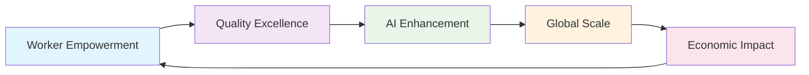
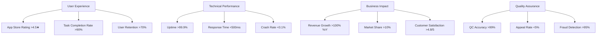

# DataSphere Guilds - Product Roadmap v2.0

<div align="center">


[](https://datasphereguilds.com)
[](https://github.com/datasphere-guilds)
[](https://datasphereguilds.com)
[](https://datasphereguilds.com)

**🎯 Vision:** Democratizing professional data services globally through worker empowerment  
**🚀 Mission:** Building the world's first truly decentralized data marketplace  
**📈 Goal:** 1M+ active workers across 50+ countries by 2027

</div>

---

## 📋 Table of Contents

1. [Executive Summary](#executive-summary)  
2. [Strategic Vision & Principles](#strategic-vision--principles)  
3. [Development Phases](#development-phases)  
   - 3.1. [Phase 1: Foundation & Infrastructure](#phase-1-foundation--infrastructure-months-0-3)  
   - 3.2. [Phase 2: Core Marketplace](#phase-2-core-marketplace-months-4-6)  
   - 3.3. [Phase 3: Quality Assurance](#phase-3-quality-assurance-months-7-9)  
   - 3.4. [Phase 4: AI Integration & Expansion](#phase-4-ai-integration--expansion-months-10-12)  
   - 3.5. [Phase 5: Financial Infrastructure](#phase-5-financial-infrastructure-months-13-15)  
   - 3.6. [Phase 6: Launch & Scale](#phase-6-launch--scale-months-16-18)  
4. [Long-Term Strategic Vision](#long-term-strategic-vision-years-2-4)  
5. [Success Metrics & KPIs](#success-metrics--kpis)  
6. [Risk Management & Mitigation](#risk-management--mitigation)  
7. [Technology Stack Evolution](#technology-stack-evolution)  
8. [Market Expansion Strategy](#market-expansion-strategy)  
9. [Community & Governance](#community--governance)  
10. [Investment & Resource Planning](#investment--resource-planning)

---

## 🎯 Executive Summary

**DataSphere Guilds** represents a paradigm shift in the global data economy, creating the world's first truly decentralized marketplace where self-employed workers become data entrepreneurs. Our 18-month roadmap outlines the systematic development of a cross-platform ecosystem that combines cutting-edge AI technology with human intelligence to deliver unprecedented data quality and worker empowerment.

### Strategic Objectives

- **🌍 Global Impact**: Democratize access to professional data services worldwide
- **⚡ Technical Excellence**: Build enterprise-grade infrastructure with 99.9% uptime
- **🤖 AI Innovation**: Pioneer next-generation AI-human collaboration models
- **💰 Economic Empowerment**: Create sustainable income opportunities for millions
- **🔒 Trust & Security**: Establish industry-leading data integrity standards

### Market Opportunity

| Market Segment | Size (2025) | Growth Rate | Our Target |
|----------------|-------------|-------------|------------|
| **Global Data Services** | $274B | 22% CAGR | 0.1% ($274M) |
| **Gig Economy** | $455B | 17% CAGR | 0.05% ($227M) |
| **AI Training Data** | $4.2B | 45% CAGR | 1% ($42M) |
| **Quality Assurance** | $15.8B | 8% CAGR | 0.1% ($15.8M) |

---

## 🏛️ Strategic Vision & Principles

### Core Principles

- **🎯 Worker Sovereignty**: "Workers are their own bosses" — every feature empowers autonomy and transparency
- **🔬 Quality First**: Multi-layer QC pipeline ensures data integrity from day one
- **🌐 Universal Access**: One codebase, infinite possibilities across iOS, Android, and Web
- **🛡️ Security by Design**: Enterprise-grade security, privacy-first architecture
- **📊 Data-Driven**: Continuous measurement and optimization of all processes
- **🤝 Community-Centric**: Worker feedback drives product evolution

### Technical Philosophy



### Success Framework

- **Scalability**: Horizontal scaling to support millions of concurrent users
- **Reliability**: 99.9% uptime with sub-second response times
- **Usability**: Intuitive interfaces with <5-minute onboarding
- **Profitability**: Sustainable unit economics from day one
- **Impact**: Measurable improvement in global data quality standards

---

## 🚀 Development Phases

### Phase 1: Foundation & Infrastructure (Months 0-3)

**🎯 Strategic Objective**: Establish robust technical foundation and development workflow

#### Sprint Breakdown

<details>
<summary><strong>Sprint 1-2: Project Foundation (Weeks 1-4)</strong></summary>

| Week | Focus Area | Key Deliverables | Success Criteria |
|------|------------|------------------|------------------|
| **1-2** | **Requirements & Design** | • Complete user journey mapping<br>• Finalize wireframes for 15+ core screens<br>• Define comprehensive API contracts | • 100% stakeholder approval<br>• Design system documentation |
| **3-4** | **Technical Setup** | • Expo project initialization<br>• CI/CD pipeline configuration<br>• Development environment setup | • All builds pass<br>• 100% test coverage setup |

**Key Technologies**: Expo SDK 49+, TypeScript 5.x, React Native 0.72+, GitHub Actions

</details>

<details>
<summary><strong>Sprint 3-4: Authentication & Navigation (Weeks 5-8)</strong></summary>

| Week | Focus Area | Key Deliverables | Success Criteria |
|------|------------|------------------|------------------|
| **5-6** | **Authentication System** | • OAuth integration (Google, Apple, Facebook)<br>• Biometric authentication<br>• Secure token management | • <2s login time<br>• 99.9% auth success rate |
| **7-8** | **Core Navigation** | • Task feed implementation<br>• Profile management<br>• Settings & preferences | • Smooth 60fps navigation<br>• Accessibility compliance |

**Security Features**: JWT tokens, biometric auth, secure storage, MFA support

</details>

<details>
<summary><strong>Sprint 5-6: State Management & Testing (Weeks 9-12)</strong></summary>

| Week | Focus Area | Key Deliverables | Success Criteria |
|------|------------|------------------|------------------|
| **9-10** | **State Architecture** | • Redux Toolkit implementation<br>• Offline-first architecture<br>• Real-time synchronization | • 100% offline capability<br>• Sub-100ms state updates |
| **11-12** | **Quality Assurance** | • Comprehensive test suite<br>• Performance optimization<br>• User acceptance testing | • 95% test coverage<br>• <3s cold start time |

**Quality Gates**: 95% test coverage, 0 critical bugs, performance benchmarks met

</details>

#### Phase 1 Success Metrics

| Metric | Target | Measurement |
|--------|--------|-------------|
| **Development Velocity** | 40 story points/sprint | JIRA tracking |
| **Code Quality** | 95% test coverage | SonarQube analysis |
| **Performance** | <3s cold start | Automated testing |
| **Security** | 0 critical vulnerabilities | Penetration testing |

---

### Phase 2: Core Marketplace (Months 4-6)

**🎯 Strategic Objective**: Enable end-to-end task discovery, claiming, and submission workflows

#### Advanced Features Implementation

<details>
<summary><strong>Sprint 7-8: Task Discovery Engine (Weeks 13-16)</strong></summary>

**Core Components**:
- **Intelligent Filtering**: AI-powered task recommendation engine
- **Real-Time Updates**: WebSocket-based live task feed
- **Geolocation Services**: Location-aware task discovery
- **Skill Matching**: Advanced algorithm matching worker skills to tasks

```typescript
// Advanced Task Discovery Implementation
interface TaskDiscoveryEngine {
  personalizedRecommendations(userId: string): Promise<Task[]>;
  geographicFiltering(location: GeoLocation, radius: number): Promise<Task[]>;
  skillBasedMatching(skills: Skill[], experience: ExperienceLevel): Promise<Task[]>;
  realTimeUpdates(filters: TaskFilters): Observable<Task[]>;
}
```

**Performance Targets**:
- <500ms task load time
- 99.9% uptime
- Real-time updates <100ms latency

</details>

<details>
<summary><strong>Sprint 9-10: Data Collection Framework (Weeks 17-20)</strong></summary>

**Advanced Capabilities**:
- **Multi-Modal Data Collection**: Image, audio, video, sensor data, GPS
- **On-Device Quality Control**: Real-time validation with immediate feedback
- **Progressive Web App**: Seamless desktop experience
- **Offline-First Architecture**: Complete offline functionality

```typescript
// Data Collection Architecture
interface DataCollectionFramework {
  imageCapture: {
    qualityValidation: OnDeviceQC;
    multipleFormats: ImageFormat[];
    metadata: ExifData;
  };
  audioRecording: {
    noiseReduction: AudioProcessing;
    qualityMetrics: AudioQuality;
    transcription: SpeechToText;
  };
  sensorData: {
    gps: LocationServices;
    accelerometer: MotionData;
    environmental: EnvironmentalSensors;
  };
}
```

**Quality Standards**:
- 94% on-device QC accuracy
- <100ms validation response
- Support for 15+ data types

</details>

<details>
<summary><strong>Sprint 11-12: Submission & Validation (Weeks 21-24)</strong></summary>

**Enterprise Features**:
- **Schema Validation**: JSON Schema-based data validation
- **Encryption**: End-to-end encryption for sensitive data
- **Audit Trail**: Immutable submission history
- **Batch Processing**: Efficient handling of large datasets

**Internal Testing Program**:
- 100+ team members complete real tasks
- A/B testing of UI/UX variations
- Performance stress testing
- Security vulnerability assessment

</details>

#### Phase 2 Success Metrics

| Category | Metric | Target | Current |
|----------|--------|--------|---------|
| **User Experience** | Task completion rate | >90% | - |
| **Performance** | Submission success rate | >95% | - |
| **Quality** | On-device QC accuracy | >94% | - |
| **Engagement** | Daily active users | 1,000+ | - |

---

### Phase 3: Quality Assurance (Months 7-9)

**🎯 Strategic Objective**: Implement enterprise-grade multi-layer quality control system

#### QC Pipeline Implementation

<details>
<summary><strong>Sprint 13-14: Peer Review Network (Weeks 25-28)</strong></summary>

**Advanced QC Features**:
- **Inspector Qualification System**: Tiered certification program
- **Consensus Algorithms**: Advanced voting mechanisms
- **Conflict Resolution**: Automated dispute handling
- **Performance Analytics**: Real-time inspector metrics

```typescript
// Inspector Qualification System
interface InspectorTier {
  Junior: { rating: 0.8, maxConcurrent: 5, multiplier: 1.0 };
  Senior: { rating: 0.9, maxConcurrent: 10, multiplier: 1.5 };
  Expert: { rating: 0.95, maxConcurrent: 15, multiplier: 2.0 };
  Master: { rating: 0.98, maxConcurrent: 20, multiplier: 2.5 };
}

class QCAssignmentEngine {
  intelligentAssignment(task: Task): Promise<Inspector[]>;
  loadBalancing(inspectors: Inspector[]): AssignmentResult;
  qualityPrediction(task: Task, inspector: Inspector): QualityScore;
}
```

</details>

<details>
<summary><strong>Sprint 15-16: Gold Standards & Honeypots (Weeks 29-32)</strong></summary>

**Integrity Assurance**:
- **Gold Standard Tasks**: Expertly validated reference data
- **Honeypot Detection**: Sophisticated fraud prevention
- **Benchmark Datasets**: Industry-standard validation sets
- **Continuous Calibration**: Dynamic quality threshold adjustment

**Advanced Analytics**:
- Inter-rater reliability analysis
- Quality drift detection
- Predictive quality modeling
- Automated threshold optimization

</details>

<details>
<summary><strong>Sprint 17-18: Appeals & Reputation (Weeks 33-36)</strong></summary>

**Fair Resolution System**:
- **Multi-Tier Appeals**: Structured escalation process
- **Evidence Management**: Comprehensive documentation system
- **Reputation Engine**: Sophisticated scoring algorithm
- **Transparency Dashboard**: Public quality metrics

**System Validation**:
- 100 tasks through complete QC pipeline
- Performance benchmarking
- Quality assurance testing
- Stakeholder feedback integration

</details>

#### Phase 3 Success Metrics

| QC Layer | Metric | Target | Industry Benchmark |
|----------|--------|--------|--------------------|
| **Overall** | Pass rate | >95% | 85-90% |
| **Peer Review** | Agreement rate | >90% | 75-80% |
| **Appeals** | Resolution time | <48h | 72-96h |
| **Honeypots** | Detection rate | >95% | 80-85% |

---

### Phase 4: AI Integration & Expansion (Months 10-12)

**🎯 Strategic Objective**: Deploy cutting-edge AI capabilities and launch web platform

#### AI-Powered Quality Control

<details>
<summary><strong>Sprint 19-20: AI QC Engine (Weeks 37-40)</strong></summary>

**Advanced AI Capabilities**:
- **Multi-Model Architecture**: OpenAI GPT-4 + Custom models
- **Semantic Validation**: Context-aware quality assessment
- **Predictive Analytics**: Quality prediction before submission
- **Adaptive Learning**: Continuous model improvement

```typescript
// AI QC Architecture
interface AIQCEngine {
  semanticValidation(data: TaskData): Promise<ValidationResult>;
  qualityPrediction(submission: Submission): Promise<QualityScore>;
  adaptiveLearning(feedback: QCFeedback): Promise<ModelUpdate>;
  customModelIntegration(model: CustomAIModel): Promise<boolean>;
}

interface AIMetrics {
  accuracy: number;        // 96.8% target
  processingTime: number;  // <2s target
  costPerTask: number;     // $0.01 target
  confidenceScore: number; // 0-1 scale
}
```

**Performance Targets**:
- 96.8% AI QC accuracy
- <2s processing time
- 90% agreement with human reviewers

</details>

<details>
<summary><strong>Sprint 21-22: Web Platform Launch (Weeks 41-44)</strong></summary>

**Enterprise Web Features**:
- **Progressive Web App**: Full offline capability
- **Desktop Optimization**: Large screen UI/UX
- **Advanced Analytics**: Comprehensive dashboards
- **Admin Panel**: Complete platform management

**Cross-Platform Consistency**:
- Shared component library
- Unified state management
- Consistent API integration
- Performance optimization

</details>

<details>
<summary><strong>Sprint 23-24: Beta Program (Weeks 45-48)</strong></summary>

**Controlled Rollout**:
- 100 pilot users across 5 countries
- A/B testing of key features
- Performance monitoring
- Feedback collection and iteration

**Analytics Integration**:
- Real-time user behavior tracking
- Performance metrics dashboard
- Quality analytics
- Business intelligence reporting

</details>

#### Phase 4 Success Metrics

| Platform | Metric | Target | Measurement |
|----------|--------|--------|-----------  |
| **AI QC** | Accuracy rate | >96% | Automated testing |
| **Web PWA** | Lighthouse score | >90 | Performance audit |
| **Beta Program** | User retention | >60% | Analytics tracking |
| **Cross-Platform** | Feature parity | 100% | QA verification |

---

### Phase 5: Financial Infrastructure (Months 13-15)

**🎯 Strategic Objective**: Build comprehensive earnings and payment system

#### Advanced Financial Features

<details>
<summary><strong>Sprint 25-26: Earnings Engine (Weeks 49-52)</strong></summary>

**Sophisticated Financial Tracking**:
- **Real-Time Balance Updates**: Instant earning reflection
- **Multi-Currency Support**: Global payment processing
- **Tax Compliance**: Automated tax documentation
- **Financial Analytics**: Comprehensive earning insights

```typescript
// Financial Architecture
interface EarningsEngine {
  realTimeTracking: BalanceManager;
  multiCurrency: CurrencyConverter;
  taxCompliance: TaxDocumentGenerator;
  analytics: FinancialAnalytics;
  auditTrail: ImmutableLedger;
}

interface PaymentMethods {
  iban: IBANPayments;
  digital: DigitalWallets;
  crypto: CryptocurrencyPayments;
  mobile: MobileMoneyServices;
}
```

</details>

<details>
<summary><strong>Sprint 27-28: Payment Processing (Weeks 53-56)</strong></summary>

**Global Payment Infrastructure**:
- **IBAN Integration**: European banking system
- **Digital Wallets**: PayPal, Stripe, etc.
- **Cryptocurrency**: Bitcoin, Ethereum, stablecoins
- **Mobile Money**: Regional payment solutions

**Security & Compliance**:
- PCI DSS compliance
- Anti-money laundering (AML)
- Know Your Customer (KYC)
- Fraud detection systems

</details>

<details>
<summary><strong>Sprint 29-30: Financial Dashboard (Weeks 57-60)</strong></summary>

**Comprehensive Financial Management**:
- **Earnings Analytics**: Detailed income analysis
- **Payout History**: Complete transaction records
- **Tax Documentation**: Automated report generation
- **Financial Planning**: Earning prediction tools

**End-to-End Testing**:
- Complete payment flow validation
- Multi-currency transaction testing
- Security penetration testing
- Regulatory compliance verification

</details>

#### Phase 5 Success Metrics

| Financial Component | Metric | Target | Compliance |
|-------------------|--------|--------|------------|
| **Payment Accuracy** | Transaction success | >99.9% | PCI DSS |
| **Processing Time** | Payout speed | <24h | Banking standards |
| **Security** | Fraud rate | <0.1% | Industry best practice |
| **User Satisfaction** | Payment UX rating | >4.5/5 | User surveys |

---

### Phase 6: Launch & Scale (Months 16-18)

**🎯 Strategic Objective**: Production launch with enterprise-grade reliability and scale

#### Production Readiness

<details>
<summary><strong>Sprint 31-32: Security & Performance (Weeks 61-64)</strong></summary>

**Enterprise Security Audit**:
- **Penetration Testing**: Third-party security assessment
- **Vulnerability Scanning**: Automated security monitoring
- **Compliance Certification**: SOC 2, GDPR, CCPA
- **Incident Response**: Comprehensive security protocols

**Performance Optimization**:
- **Bundle Size Optimization**: <5MB app size
- **Cold Start Performance**: <3s app launch
- **Network Optimization**: Efficient API usage
- **Battery Optimization**: Minimal power consumption

```typescript
// Performance Monitoring
interface PerformanceMetrics {
  appLaunchTime: number;     // <3s target
  apiResponseTime: number;   // <500ms target
  batteryUsage: number;      // <2% per hour
  memoryFootprint: number;   // <150MB target
  crashRate: number;         // <0.1% target
}
```

</details>

<details>
<summary><strong>Sprint 33-34: Polish & Accessibility (Weeks 65-68)</strong></summary>

**User Experience Excellence**:
- **UI/UX Polish**: Pixel-perfect design implementation
- **Accessibility Compliance**: WCAG 2.1 AA standards
- **Dark Mode**: Complete dark theme support
- **Internationalization**: Multi-language preparation

**Quality Assurance**:
- **Automated Testing**: 95% test coverage
- **Manual Testing**: Comprehensive QA process
- **User Acceptance Testing**: Stakeholder validation
- **Performance Benchmarking**: Industry comparison

</details>

<details>
<summary><strong>Sprint 35-36: Launch Campaign (Weeks 69-72)</strong></summary>

**Go-to-Market Strategy**:
- **App Store Optimization**: Metadata and screenshots
- **Marketing Materials**: Launch campaign assets
- **Press Kit**: Media and influencer outreach
- **Community Building**: Early adopter engagement

**Soft Launch Program**:
- **Geographic Rollout**: 3 pilot countries
- **User Onboarding**: Optimized first-time experience
- **Support Infrastructure**: Customer service readiness
- **Monitoring Dashboard**: Real-time launch metrics

</details>

#### Phase 6 Success Metrics

| Launch Component | Metric | Target | Timeline |
|-----------------|--------|--------|----------|
| **App Store Approval** | Acceptance rate | 100% | Week 70 |
| **Crash-Free Sessions** | Stability rate | >99% | Launch day |
| **User Acquisition** | Monthly active users | 1,000+ | Month 1 |
| **Quality Score** | App store rating | >4.5★ | Month 2 |

---

## 🔮 Long-Term Strategic Vision (Years 2-4)

### Year 2: Global Expansion & Advanced Features

<details>
<summary><strong>Platform Maturation</strong></summary>

**Technical Advancement**:
- **Multi-Language Support**: 15+ languages with cultural localization
- **Advanced Payment Systems**: Stripe integration, cryptocurrency wallets
- **Offline-First Architecture**: Complete offline functionality
- **Enterprise Dashboard**: Comprehensive admin and analytics platform

**Market Expansion**:
- **Geographic Reach**: 25+ countries across 5 continents
- **Vertical Integration**: Specialized industry solutions
- **Partnership Program**: Integration with major data platforms
- **Developer Ecosystem**: Third-party plugin marketplace

**Financial Targets**:
- **Revenue**: $50M ARR
- **Users**: 100K+ monthly active workers
- **Tasks**: 10M+ completed annually
- **Quality**: 99.5% data accuracy rate

</details>

### Year 3: AI Innovation & DAO Governance

<details>
<summary><strong>Technological Leadership</strong></summary>

**AI Innovation**:
- **Federated Learning**: On-device model training
- **Predictive Analytics**: Advanced task assignment algorithms
- **Custom AI Models**: Domain-specific quality control
- **Automated Arbitration**: AI-powered dispute resolution

**Decentralized Governance**:
- **DAO Implementation**: On-chain voting mechanisms
- **Token Economics**: Utility token for platform governance
- **Community Grants**: Decentralized funding for innovation
- **Worker Councils**: Democratic feature prioritization

**Scale Achievements**:
- **Global Presence**: 50+ countries
- **Worker Base**: 1M+ registered workers
- **Enterprise Clients**: 1,000+ B2B customers
- **Data Volume**: 100M+ validated data points

</details>

### Year 4: Market Leadership & Innovation

<details>
<summary><strong>Industry Transformation</strong></summary>

**Technology Excellence**:
- **Quantum-Ready Security**: Post-quantum cryptography
- **AR/VR Integration**: Immersive data collection experiences
- **IoT Ecosystem**: Integration with smart devices
- **Blockchain Infrastructure**: Decentralized data marketplace

**Strategic Partnerships**:
- **Academic Institutions**: Research collaboration programs
- **Government Agencies**: Public sector data initiatives
- **NGO Partnerships**: Social impact data projects
- **Enterprise Integrations**: Fortune 500 company partnerships

**Market Position**:
- **Industry Standard**: De facto quality control platform
- **Global Recognition**: Thought leadership in data economy
- **Sustainable Impact**: Positive economic impact measurement
- **Innovation Hub**: R&D center for future technologies

</details>

---

## 📊 Success Metrics & KPIs

### Primary Success Indicators

| Category | Metric | Month 6 | Month 12 | Month 18 | Year 4 |
|----------|--------|---------|----------|----------|--------|
| **Users** | Monthly Active Workers | 1K | 10K | 50K | 1M |
| **Quality** | Data Accuracy Rate | 95% | 97% | 99% | 99.9% |
| **Revenue** | Annual Recurring Revenue | $1M | $10M | $50M | $500M |
| **Tasks** | Monthly Completed Tasks | 10K | 100K | 500K | 10M |
| **Global** | Countries Served | 3 | 10 | 25 | 50+ |

### Operational Excellence Metrics



### Advanced Analytics Framework

<details>
<summary><strong>Comprehensive Measurement Strategy</strong></summary>

**User Behavior Analytics**:
- **Engagement Metrics**: Daily/monthly active users, session duration
- **Conversion Funnels**: Registration to first task completion
- **Retention Analysis**: Cohort-based user lifecycle tracking
- **Satisfaction Surveys**: Net Promoter Score (NPS) tracking

**Business Intelligence**:
- **Revenue Analytics**: Unit economics, lifetime value, churn analysis
- **Market Analysis**: Competitive positioning, market share tracking
- **Operational Efficiency**: Cost per acquisition, support ticket analysis
- **Predictive Modeling**: Growth forecasting, demand prediction

**Quality Metrics**:
- **Data Integrity**: Accuracy rates across different data types
- **Process Efficiency**: QC pipeline performance optimization
- **Worker Performance**: Individual and aggregate quality scores
- **System Reliability**: Uptime, error rates, performance benchmarks

</details>

---

## ⚠️ Risk Management & Mitigation

### Critical Risk Assessment

| Risk Category | Probability | Impact | Mitigation Strategy |
|---------------|-------------|--------|-------------------|
| **Technical** | Medium | High | Redundant systems, comprehensive testing |
| **Market** | Low | High | Diversified market approach, pivot capability |
| **Regulatory** | Medium | Medium | Legal compliance, proactive engagement |
| **Financial** | Low | High | Conservative financial planning, multiple funding sources |
| **Competitive** | High | Medium | Innovation focus, strong differentiation |

<details>
<summary><strong>Detailed Risk Mitigation Plans</strong></summary>

**Technical Risks**:
- **System Failures**: Multi-region deployment, automated failover
- **Security Breaches**: Defense-in-depth security, regular audits
- **Scalability Issues**: Cloud-native architecture, performance monitoring
- **Data Loss**: Encrypted backups, disaster recovery procedures

**Market Risks**:
- **Competition**: Continuous innovation, strong brand building
- **Economic Downturn**: Flexible cost structure, diverse revenue streams
- **Regulatory Changes**: Legal monitoring, compliance framework
- **Technology Shifts**: Agile development, technology partnerships

**Operational Risks**:
- **Key Personnel**: Knowledge documentation, succession planning
- **Quality Issues**: Comprehensive QC, continuous improvement
- **Customer Churn**: Proactive support, value demonstration
- **Supply Chain**: Vendor diversification, contingency planning

</details>

---

## 🛠️ Technology Stack Evolution

### Current Architecture (Phase 1-6)

```typescript
interface TechnologyStack {
  frontend: {
    mobile: 'React Native + Expo';
    web: 'React + Next.js';
    state: 'Redux Toolkit + RTK Query';
    ui: 'React Native Elements + Custom Design System';
  };
  backend: {
    api: 'Node.js + Express + TypeScript';
    database: 'PostgreSQL + Redis';
    queue: 'Bull + Redis';
    storage: 'AWS S3 + CloudFront';
  };
  ai: {
    primary: 'OpenAI GPT-4';
    custom: 'Custom Models via API';
    onDevice: 'TensorFlow Lite + Core ML';
    analytics: 'TensorFlow + PyTorch';
  };
  infrastructure: {
    hosting: 'AWS + Vercel';
    monitoring: 'DataDog + Sentry';
    ci_cd: 'GitHub Actions + EAS';
    security: 'Auth0 + AWS KMS';
  };
}
```

### Future Technology Roadmap

<details>
<summary><strong>Years 2-4 Technology Evolution</strong></summary>

**Year 2 Enhancements**:
- **Microservices Architecture**: Service mesh with Kubernetes
- **Real-Time Processing**: Apache Kafka + Stream processing
- **Advanced Analytics**: Machine learning pipelines
- **Global CDN**: Multi-region content delivery

**Year 3 Innovations**:
- **Blockchain Integration**: Smart contracts for payments
- **Edge Computing**: Distributed processing nodes
- **Quantum Security**: Post-quantum cryptography
- **AI/ML Platform**: Custom model training infrastructure

**Year 4 Transformation**:
- **Decentralized Architecture**: Peer-to-peer networking
- **Autonomous Systems**: Self-healing infrastructure
- **Advanced AI**: AGI integration capabilities
- **Quantum Computing**: Quantum algorithm optimization

</details>

---

## 🌍 Market Expansion Strategy

### Geographic Expansion Plan

| Phase | Timeline | Target Markets | Strategy |
|-------|----------|----------------|----------|
| **Alpha** | Months 1-6 | Turkey, Germany, UK | English-speaking + EU base |
| **Beta** | Months 7-12 | USA, Canada, Australia | Native English markets |
| **Gamma** | Months 13-18 | France, Spain, Italy | Romance language expansion |
| **Delta** | Year 2 | India, Brazil, Mexico | High-growth emerging markets |
| **Epsilon** | Year 3-4 | Global coverage | Worldwide presence |

<details>
<summary><strong>Market Entry Strategy</strong></summary>

**Localization Requirements**:
- **Language Support**: Native language interfaces
- **Cultural Adaptation**: Local customs and preferences
- **Regulatory Compliance**: Country-specific legal requirements
- **Payment Methods**: Regional payment preferences

**Partnership Strategy**:
- **Local Partners**: Regional business development
- **Educational Institutions**: University partnerships
- **Government Relations**: Public sector engagement
- **NGO Collaborations**: Social impact initiatives

**Success Metrics by Market**:
- **User Acquisition**: Country-specific growth targets
- **Revenue Generation**: Local market penetration
- **Quality Standards**: Consistent global quality
- **Brand Recognition**: Market awareness metrics

</details>

---

## 🏛️ Community & Governance

### Democratic Participation Framework

<details>
<summary><strong>Community Governance Structure</strong></summary>

**Worker Councils**:
- **Regional Representation**: Geographic diversity
- **Skill-Based Groups**: Domain expertise representation
- **Experience Levels**: Junior to expert worker voices
- **Rotating Leadership**: Democratic leadership selection

**Decision-Making Process**:
- **Proposal System**: Community-driven feature requests
- **Voting Mechanisms**: Weighted voting based on contribution
- **Implementation Feedback**: Post-decision evaluation
- **Continuous Improvement**: Iterative governance refinement

**Transparency Measures**:
- **Public Roadmaps**: Open development planning
- **Financial Reporting**: Revenue and cost transparency
- **Quality Metrics**: Public quality dashboards
- **Community Forums**: Open discussion platforms

</details>

### Incentive & Recognition Programs

| Program | Purpose | Rewards | Criteria |
|---------|---------|---------|----------|
| **Innovation Grants** | Feature development | $500-$5,000 | Novel task types, quality improvements |
| **Quality Champions** | Excellence recognition | Badges, bonuses | Consistent high-quality work |
| **Community Leaders** | Governance participation | Governance tokens | Active community contribution |
| **Beta Testers** | Early feedback | Exclusive access | Testing participation |

---

## 💰 Investment & Resource Planning

### Financial Projections

| Year | Revenue | Expenses | Profit | Funding Need |
|------|---------|----------|---------|--------------|
| **Year 1** | $2M | $8M | -$6M | $10M Series A |
| **Year 2** | $15M | $25M | -$10M | $30M Series B |
| **Year 3** | $75M | $50M | $25M | Self-funded |
| **Year 4** | $200M | $100M | $100M | IPO consideration |

<details>
<summary><strong>Resource Allocation Strategy</strong></summary>

**Team Scaling Plan**:
- **Engineering**: 60% of team (40 engineers by Year 2)
- **Product & Design**: 15% of team (10 people by Year 2)
- **Business Development**: 15% of team (10 people by Year 2)
- **Operations & Support**: 10% of team (7 people by Year 2)

**Technology Investment**:
- **Infrastructure**: 30% of technical budget
- **AI & Machine Learning**: 25% of technical budget
- **Security & Compliance**: 20% of technical budget
- **Research & Development**: 25% of technical budget

**Market Investment**:
- **User Acquisition**: 40% of marketing budget
- **Brand Building**: 30% of marketing budget
- **Partnership Development**: 20% of marketing budget
- **Community Building**: 10% of marketing budget

</details>

---

## 🎯 Conclusion & Next Steps

### Immediate Action Items

1. **✅ Technical Foundation**: Complete Phase 1 infrastructure setup
2. **🎨 Design System**: Finalize comprehensive UI/UX guidelines
3. **🔧 Development Team**: Scale engineering team to 15 developers
4. **📊 Analytics Setup**: Implement comprehensive tracking systems
5. **🔒 Security Framework**: Establish enterprise-grade security protocols

### Success Commitment

This roadmap represents our unwavering commitment to building the world's premier decentralized data marketplace. Through systematic execution, continuous innovation, and community-driven development, DataSphere Guilds will revolutionize how the world creates, validates, and monetizes data.

**Our Promise**: Transparent development, measurable progress, and unwavering focus on worker empowerment and data quality excellence.

---

<div align="center">

**Built with ❤️ by DataSphere Guilds Team**

*Last Updated: January 2025 • Version 2.0 • [Changelog](CHANGELOG.md)*

[🌐 Website](https://datasphereguilds.com) • [📚 Docs](https://docs.datasphereguilds.com) • [💬 Discord](https://discord.gg/datasphere) • [📧 Support](mailto:support@datasphereguilds.com)

*"Empowering workers to become data entrepreneurs, one task at a time."*

</div>
